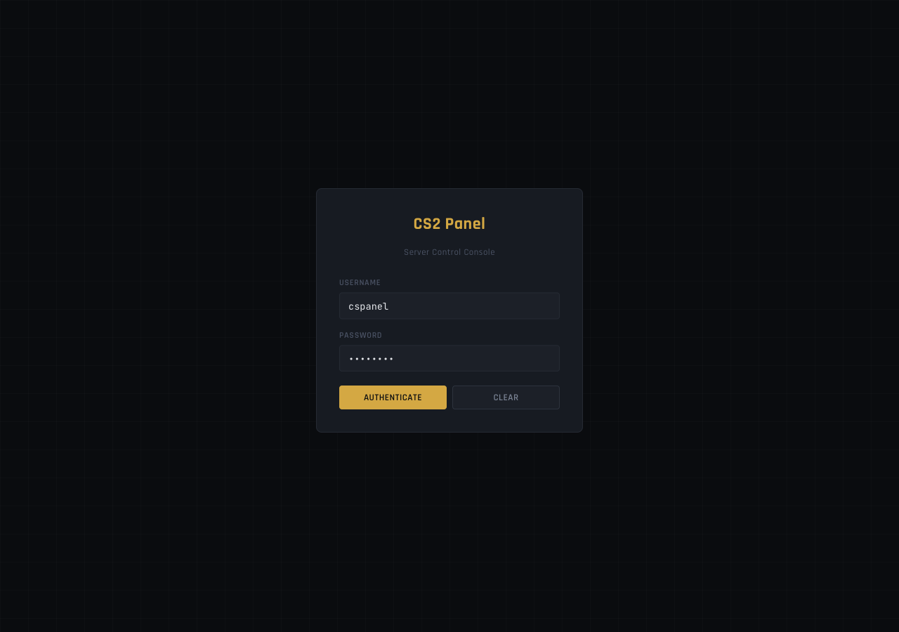
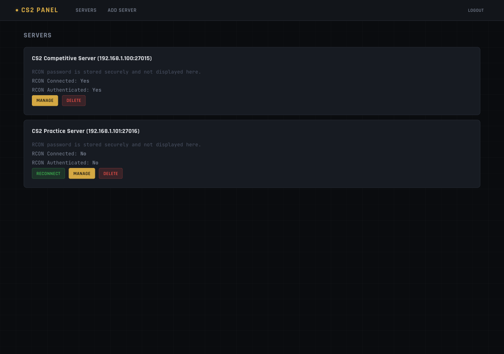
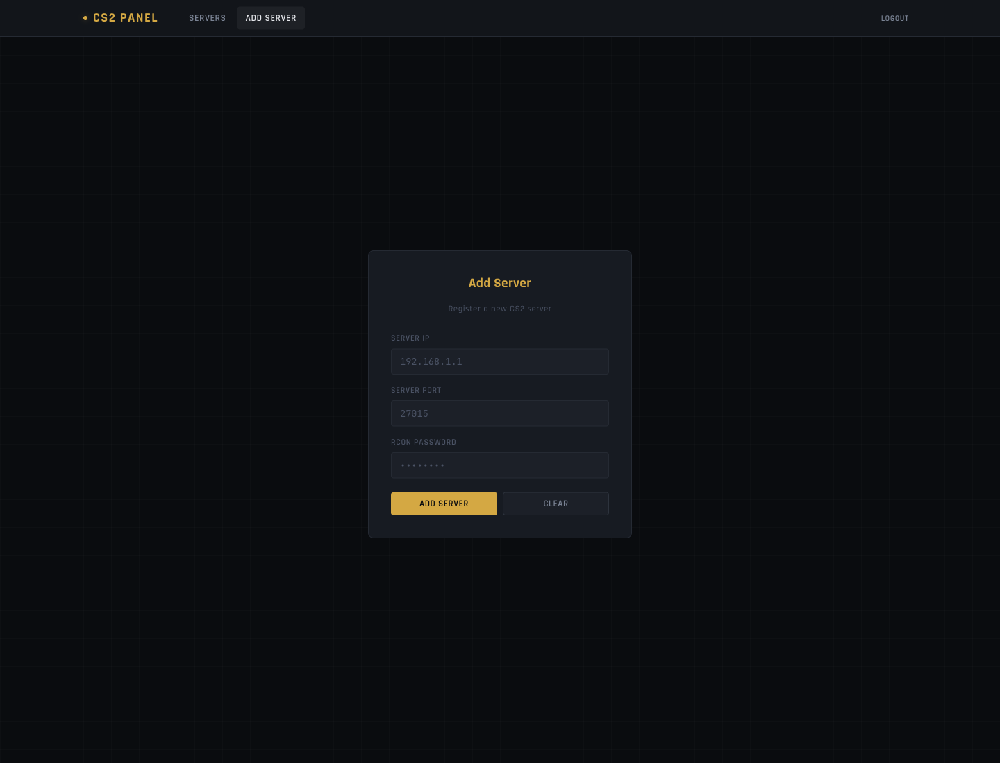
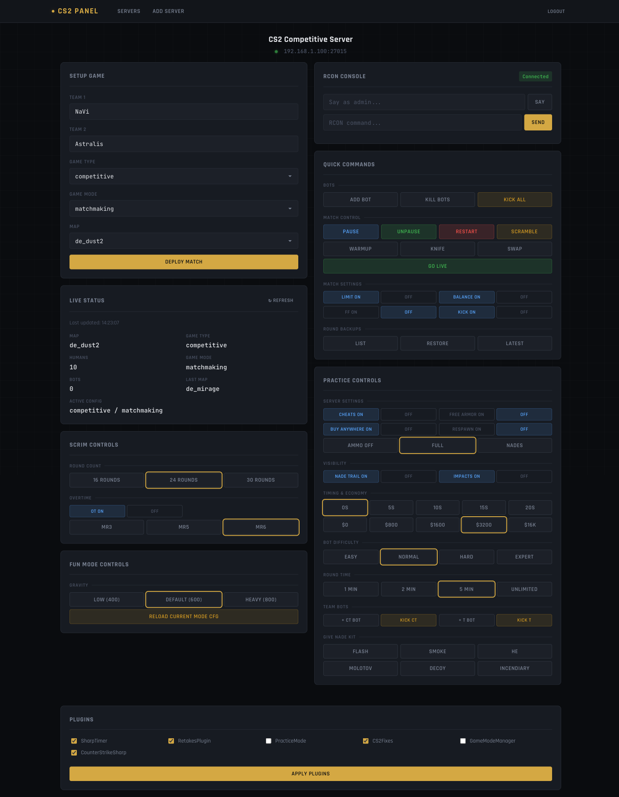
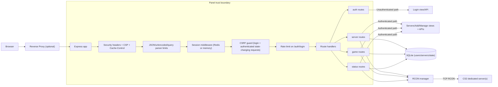

# CS2 Modded Server Panel

[](https://github.com/sebastianspicker/cs2-modded-server-panel/actions/workflows/ci.yml)

A TypeScript/Node.js web panel to control and monitor modded Counter-Strike 2 servers via RCON.

> This repository is a fork of [shobhit-pathak/cs2-rcon-panel](https://github.com/shobhit-pathak/cs2-rcon-panel)
> with a focus on containerized deployment and Pterodactyl support.

## Overview

Use this panel to manage CS2 servers, run RCON commands, configure match setup, and track live state.
It is designed to run in Docker and as a Pterodactyl Egg, with a local dev flow for contributors.

## Features

- Written in TypeScript end-to-end — server (`tsx` for dev, `tsc` for production) and client (esbuild bundle)
- Web interface for managing modded Counter-Strike 2 servers
- RCON connection and live console output
- Practice, scrim, and fun mode controls (round time, overtime, bots, gravity, weapon shortcuts)
- Session-based authentication (bcrypt)
- SQLite-backed server management UI
- Deployment via Docker and Pterodactyl
- Map/mode/config support via `cfg/maps.json`

## Screenshots

### Login



### Server Management



### Add Server



### Manage Server



## Requirements

- Node.js `>=22` (see `engines` in `package.json`)
- npm (TypeScript is a dev dependency — no global install needed)
- Optional: Docker (for container builds and CI validation)
- Optional: Redis (recommended for production session storage)

## How it works

Request flow: the browser reaches Express directly or via a reverse proxy. Inside the panel trust boundary, requests pass through parser/security middleware, then session/CSRF/rate-limit layers, and finally route groups (`auth`, `server`, `game`, `status`). Route handlers use SQLite for persisted state and the RCON manager for live server control.



Lifecycle: startup first enforces production guards, then opens/migrates DB state and applies default-user policy, then boots HTTP and initializes RCON connections. Runtime continuously serves HTTP requests and maintains per-server heartbeat/reconnect loops.

```mermaid
flowchart TB
  Boot["Process boot"] --> Guards["Env guard checks"]
  Guards -->|prod: SESSION_SECRET missing| Fail["Fail fast / exit"]
  Guards -->|prod: Redis missing| Fail
  Guards -->|prod: RCON_SECRET_KEY missing| Fail
  Guards -->|all required env present| OpenDb["Open DB path"]

  OpenDb -->|open failed (prod or explicit DB_PATH)| Fail
  OpenDb --> Migrate["Create tables + run migrations"]
  Migrate --> Encrypt["Encrypt plaintext stored RCON secrets (when key configured)"]
  Encrypt --> DefaultUser["Apply default-user policy"]
  DefaultUser --> AppBoot["Initialize Express middleware + routes"]
  AppBoot --> SessionInit["Session store init/connect"]
  SessionInit --> Listen["app.listen()"]
  Listen --> RconInit["RCON manager init (load servers)"]
  RconInit --> Runtime["Runtime loop"]

  Runtime --> HttpFlow["Handle HTTP requests"]
  HttpFlow --> RouteFlow["auth/server/game/status routes"]
  RouteFlow --> DbIo["SQLite reads/writes"]
  RouteFlow --> RconExec["RCON command execution"]
  HttpFlow --> Health["/api/health (200/503; verbose if enabled/authenticated)"]

  Runtime --> Heartbeat["Per-server heartbeat interval (5s)"]
  Heartbeat -->|timeout/unwritable/auth lost| Reconnect["disconnect + reconnect"]
  Reconnect --> Heartbeat
```

For code layout and hotspots, see [docs/REPO_MAP.md](docs/REPO_MAP.md).

## Quickstart

### Docker Compose (recommended)

```bash
git clone https://github.com/sebastianspicker/cs2-modded-server-panel.git
cd cs2-modded-server-panel

cp .env.example .env
# Edit .env — set DEFAULT_USERNAME, DEFAULT_PASSWORD, SESSION_SECRET at minimum

docker compose up -d
```

Panel will be available at `http://localhost:3000`.

### Docker (standalone)

```bash
docker build -t cs2-modded-server-panel .

docker run -d -p 3000:3000 \
  -e DEFAULT_USERNAME=youradmin \
  -e DEFAULT_PASSWORD=yourpassword \
  -e ALLOW_DEFAULT_CREDENTIALS=true \
  -e SESSION_SECRET=$(openssl rand -hex 32) \
  -e PORT=3000 \
  cs2-modded-server-panel
```

### Pterodactyl

Import [`cs2-modded-server-panel_egg.json`](cs2-modded-server-panel_egg.json) as a Pterodactyl Egg
and set the Docker image to `sebastianspicker/cs2-modded-server-panel:latest`.
Configure environment variables (see table below) in the Pterodactyl panel.

> The Egg install script is pinned to a specific commit for reproducibility.
> Update the pin when releasing new versions.

### Local Development

```bash
cat .nvmrc          # confirm Node version
npm ci
cp .env.example .env
npm run build:client   # compile public/ts/ → public/js/console.js
npm run dev
```

## Configuration

### Environment Variables

| Variable                    | Description                                                    | Default                           |
| --------------------------- | -------------------------------------------------------------- | --------------------------------- |
| `DEFAULT_USERNAME`          | Default admin login username                                   | `cspanel`                         |
| `DEFAULT_PASSWORD`          | Default admin login password                                   | set in env                        |
| `ALLOW_DEFAULT_CREDENTIALS` | Allow built-in default credentials                             | `false`                           |
| `SESSION_SECRET`            | Session signing secret (production)                            | _unset_                           |
| `SESSION_COOKIE_SECURE`     | Set to `true` behind HTTPS                                     | `false`                           |
| `SESSION_COOKIE_SAMESITE`   | Session cookie SameSite value                                  | `lax`                             |
| `SESSION_COOKIE_NAME`       | Session cookie name                                            | `cspanel.sid`                     |
| `TRUST_PROXY`               | Express trust proxy setting                                    | _unset_                           |
| `REDIS_URL`                 | Redis connection URL (session store, required in production)   | _unset_                           |
| `REDIS_HOST` / `REDIS_PORT` | Alternative to `REDIS_URL`                                     | _unset_ / `6379`                  |
| `PORT`                      | Port the panel runs on                                         | `3000`                            |
| `DB_PATH`                   | SQLite DB file path                                            | `/home/container/data/cspanel.db` |
| `SESSION_MAX_AGE_MS`        | Session cookie max age (milliseconds)                          | `86400000` (24h)                  |
| `RCON_COMMAND_TIMEOUT_MS`   | RCON command timeout (milliseconds)                            | `2000`                            |
| `CONTENT_SECURITY_POLICY`   | Override built-in CSP response header                          | built-in safe default             |
| `HEALTHCHECK_VERBOSE`       | Include DB/Redis details in `/api/health`                      | `false`                           |
| `RCON_SECRET_KEY`           | Encrypt/decrypt stored RCON passwords (required in production) | _unset_                           |

> When the database has no users, the panel creates a default admin only if
> `ALLOW_DEFAULT_CREDENTIALS=true`. Otherwise no user is created; set the flag to
> `true` and provide `DEFAULT_USERNAME`/`DEFAULT_PASSWORD` for first-run setup.
> In production, placeholder passwords (for example `change-me`) are rejected.
>
> Generate `RCON_SECRET_KEY` with:
> `node -e "console.log(require('crypto').randomBytes(32).toString('base64'))"`

## Development

```bash
npm run dev
```

### Lint

```bash
npm run lint
```

### Format

```bash
npm run format
```

### Tests

```bash
npm test
```

### Validation

```bash
# Shell lint + format check, JSON/YAML validation
npm run validate

# Enforce Docker build + compose config (requires Docker daemon)
npm run validate -- --require-docker
```

### Full CI Loop

```bash
npm run ci
```

## Security

- CSRF protection is enforced for authenticated POST requests.
- Set `SESSION_SECRET` in production and enable `SESSION_COOKIE_SECURE=true` behind HTTPS.
- Redis sessions are required in production (`REDIS_URL` or `REDIS_HOST`/`REDIS_PORT`).
- Default credentials are blocked unless `ALLOW_DEFAULT_CREDENTIALS=true`.

## Troubleshooting

- **`npm ci` fails**: Ensure Node.js 22+ is active (`cat .nvmrc`).
- **`npm run validate` fails**: Install `shellcheck`, `shfmt`, `jq`, and `ruby`.
- **Docker validation skipped**: Docker daemon not available; run without `--require-docker`.
- **Auth fails on fresh install**: Set `DEFAULT_USERNAME`, `DEFAULT_PASSWORD`, and
  `ALLOW_DEFAULT_CREDENTIALS` appropriately.
- **Session store warning**: Configure Redis with `REDIS_URL` for production stability.

## Project Structure

```
├── app.ts                 # Express app entry
├── db.ts                  # SQLite init and default user
├── modules/               # RCON manager, auth middleware
├── routes/
│   ├── auth.ts            # Login / logout
│   ├── server.ts          # Server CRUD, manage UI
│   ├── status.ts          # Live status aggregation
│   └── game/
│       ├── helpers.ts     # Shared validators and route factories
│       ├── match.ts       # Match setup, backups, RCON/say
│       ├── controls.ts    # Practice / scrim / fun controls
│       └── index.ts       # Assembler
├── public/
│   ├── css/panel.css      # Dark tactical UI stylesheet
│   ├── ts/                # Client-side TypeScript source
│   │   ├── common.ts      # Shared helpers (toast, sendPostRequest)
│   │   ├── servers.ts     # Servers page
│   │   ├── manage.ts      # Manage page
│   │   └── console.ts     # Entry point (bundled by esbuild)
│   └── js/console.js      # Compiled bundle (gitignored)
├── views/                 # EJS templates
├── cfg/                   # maps.json, plugins.json, game configs
├── types/                 # Shared TypeScript declarations
├── utils/                 # parseServerId, mapsConfig, rconResponse
├── scripts/               # format, validate, ci-local, pterodactyl-install
├── test/                  # Unit and entrypoint tests
├── docs/                  # Runbook, release docs, repo map, audit, screenshots
├── Dockerfile
├── docker-compose.yaml
└── cs2-modded-server-panel_egg.json
```

## Validation Commands

| Action     | Command                                                                        |
| ---------- | ------------------------------------------------------------------------------ |
| Install    | `npm ci`                                                                       |
| Build      | `docker build -t cs2-modded-server-panel .` (optional)                         |
| Run        | `npm run dev` or `npm start`                                                   |
| Type-check | `npm run typecheck`                                                            |
| Test       | `npm test`                                                                     |
| Lint       | `npm run lint`                                                                 |
| Format     | `npm run format` then `npm run format:check`                                   |
| Validate   | `npm run validate` (shell/config); add `-- --require-docker` for Docker checks |
| Full CI    | `npm run ci`                                                                   |

## Notes

- Audit reports and findings live under `docs/audit/`.
- `scripts/pterodactyl-install.sh` mirrors the Egg’s embedded install script for review and shellcheck.
